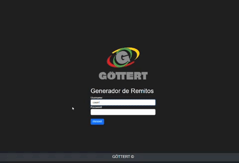

# Iniciando la Aplicación GeneradorRemitosClientes

¡Bienvenido! Esta guía te llevará a través de los pasos para configurar y ejecutar la aplicación GeneradorRemitosClientes en tu entorno local.

## Acerca de la Aplicación

La aplicación GeneradorRemitosClientes fue creada con el propósito de simplificar y optimizar el proceso de generación de remitos para clientes. Esta herramienta proporciona una interfaz intuitiva que permite a los usuarios crear y gestionar remitos de manera eficiente. Además, ofrece una funcionalidad de gestión de clientes para mantener una base de datos organizada de información relevante sobre los clientes.

### Características Principales

- **Generación Rápida de Remitos:** La aplicación permite a los usuarios generar remitos de forma rápida y sencilla, agilizando el flujo de trabajo.
- **Almacenamiento en la Nube:** Gracias a la integración con Firebase, los remitos generados se almacenan de manera segura en la nube, lo que garantiza su disponibilidad y acceso desde cualquier lugar.
- **Inicio de Sesión Seguro:** La aplicación implementa un sistema básico de inicio de sesión para proteger el acceso a las funciones y datos sensibles.
- **Gestión de Clientes:** Los usuarios pueden agregar y mantener una base de datos de información sobre sus clientes, lo que facilita la gestión de relaciones.

### Uso de la Función de Gestión de Clientes

1. Inicia sesión en la aplicación.
2. Navega a la sección de gestión de clientes.
3. Agrega nuevos clientes proporcionando la información necesaria.
4. Consulta, edita o elimina la información de los clientes según sea necesario.

# Iniciando la Aplicación GeneradorRemitosClientes

¡Bienvenido! Esta guía te llevará a través de los pasos para configurar y ejecutar la aplicación GeneradorRemitosClientes en tu entorno local.

## Paso 1: Clonar el Repositorio

Primero, clona este repositorio en tu máquina local:

git clone https://github.com/ramabeni94dev/GeneradorRemitosClientes.git
cd GeneradorRemitosClientes

## Paso 2: Instalar Dependencias

Utilizaremos npm para instalar las dependencias necesarias. Ejecuta el siguiente comando en tu terminal:

npm install

## Paso 3: Configurar Credenciales de Firebase

Asegúrate de crear un archivo .env en la raíz del proyecto y coloca las credenciales de Firebase dentro del mismo:

FIREBASE_API_KEY=<TU_API_KEY>
FIREBASE_AUTH_DOMAIN=<TU_AUTH_DOMAIN>
FIREBASE_PROJECT_ID=<TU_PROJECT_ID>
FIREBASE_STORAGE_BUCKET=<TU_STORAGE_BUCKET>
FIREBASE_MESSAGING_SENDER_ID=<TU_MESSAGING_SENDER_ID>
FIREBASE_APP_ID=<TU_APP_ID>

## Paso 4: Crear la Imagen Docker

Construiremos una imagen Docker para la aplicación. Abre tu terminal y ejecuta:

docker build -t appgeneradorremitosclientes:v1 .

## Paso 5: Verificar la Imagen Docker

Verifica que la imagen se haya creado correctamente ejecutando:

docker images

## Paso 6: Ejecutar la Aplicación Localmente

Para ejecutar la aplicación en tu entorno local, utilizaremos Docker Compose. Ejecuta:

docker-compose up

## Paso 7:Acceder a la Aplicación

Una vez que la aplicación esté en funcionamiento, abre tu navegador web y ve a la siguiente dirección:

http://localhost:5000

## ¡Eso es todo! La aplicación GeneradorRemitosClientes debería estar ahora funcionando en tu máquina local.

## Inicio de Sesión

La aplicación GeneradorRemitosClientes utiliza un sistema de inicio de sesión. Puedes utilizar las siguientes credenciales para acceder a la aplicación:

username: "usuario1",
password: "1234",

## Problemas y Soporte

Si encuentras algún problema durante estos pasos, no dudes en consultar la documentación o crear un problema en este repositorio. Estaremos encantados de ayudarte.

